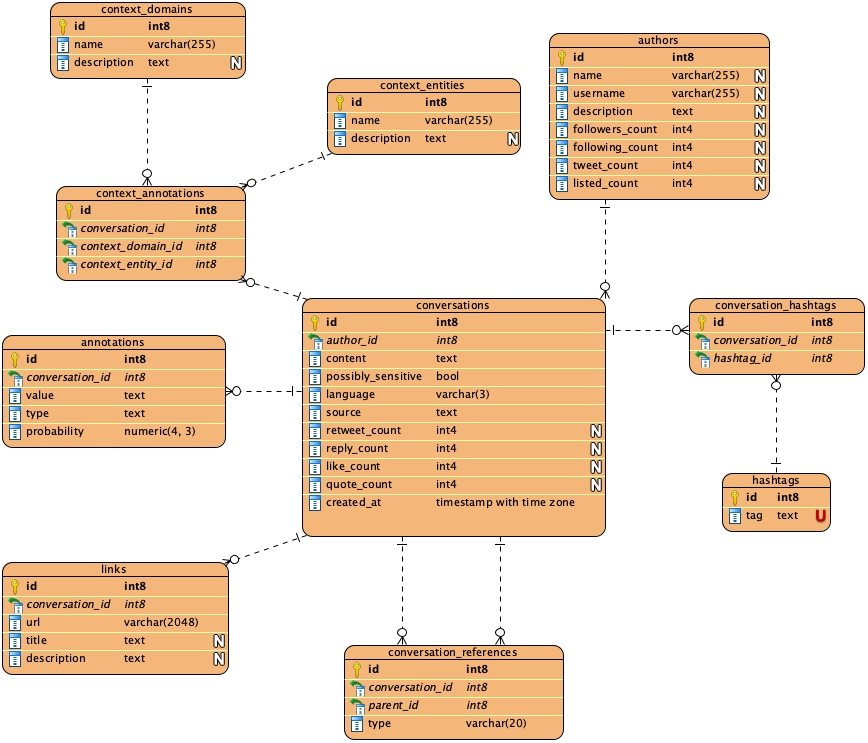
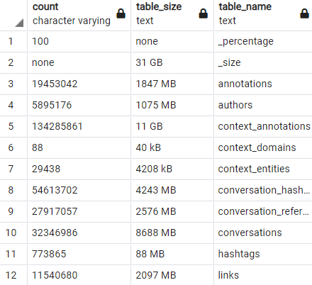

<h1> Zadanie1 <h1>

Cieľom zadania bolo importovať dáta veľkého rozsahu do databázy podľa štruktúry opísanej na obrázku v zadaní.

<h2>Opis algoritmu<h2>
V mojom riešení som postupoval následovne. Najskôr som si rozbalil dané .gz súbory pomocou scriptu gun_zip.py. Ako výsledok tohto
scriptu boli súbory authors.jsonl a conversations.jsonl. Rozhodol som sa postupovať tak že tieto súbory prejdem záznam po zázname,
vytvorím z nich .csv súbory ktoré následne pomocou SQL príkazu COPY vkladám do jednotlivých tabuliek. 

Algoritmus na transformáciu do .csv súborov sa nachádza v súbore import_db.py. Najskôr v tomto programe prejdem celý súbor authors.jsonl
a vytvorím z nich .csv záznamy vo formáte definovanom tabuľkou authors. Kontrola správnosti záznamu taktiež priebeha pri tomto iterovaní, takže vo výsledku mám už len validné záznamy. Celá konverzia z .jsonl na .csv trvá necelé 4 minúty, ako môžeme vidieť pri
meraní času v súbore time_authors.csv (porovnanie prvého a posledného času). 

Ďalej algoritmus prejde podobným spôsobom aj conversations.jsonl a vytvára z neho záznamy do viacerých .csv súborov (každá tabuľka má 
vlastný .csv súbor). Kvôli veľkému množstvu záznamov v .jsonl súboru je potrebné .csv súbor pre niektoré tabuľky rozdeliť na viacero
.csv súborov, ktoré sú neskôr vkladané samostatne do tabuliek. 

Validácia záznamov sa taktiež odohráva v tomto scripte, čo znamená že do tabuliek sa budú vkladať už len správne záznamy, a tým sa znižuje čas importu do DB. Celkový čas pre konverziu z .jsonl na jednotlivé .csv súbory trvá približne hodinu. 

Jedinečnosť pre záznamy (vyhnutie sa duplikátom) som riešil pomocou slovníkov. Tento prístup som zvolil najmä preto, že slovníky majú najrychlejšiu dobu prístupu (O(1)), aj keď v prípade python slovníkov je táto zložitosť o niečo vyššia, je stále rychlejšia ako kontrola cez SQL príkazy.

<h3>Obmedzenia<h3>
V mojom riešení som chcel pôvodne implementovať volanie querys z tohto scriptu no nepodarilo sa mi rozbehať psycopg modul na mojom počítači, ktorý je potrebný na pripojenie k databáze a možnosť volať query z kódu, preto samotné querys sú púštané manuálne cez pgAdmin. V sekcii SQL je však uvedené celá query, ktorá keď sa spustí už s vygenerovanými .csv súbormi, vytvorí a naplní všetky tabuľky v DB (súbor SQL/postgre_query.sql).

Pri vytváraní .csv súborov z conversations mi nastal problém, a to ten že sa mi záhadne stratilo 25 záznamov z conversations - ich ID boli evidované v dictionaries ale vo výslednom .csv súbore chýbali. 3 dni som strávil nad touto problematikou a nenasiel žiaden dôvod, prečo by sa malo toto diať (aj keď som zapisoval do dictionary hneď po tom, čo som zapísal záznam). Najväčšou záhadou ostalo to, že dané záznamy neboli zahodené úplne nakoľko sa vytvorili záznamy do ostatných tabuliek z príslušných záznamov a jediný záznam, ktorý sa nevytvoril bol do tabuľky conversations.

Pre tento problém nastal potom problém s ostatnými tabuľkami, kde sa záznamy odkazovali na neexistujúci záznam do tabuľky conversations. Tento problém som teda riešil pomocou dočasných tabuliek, kde sa najskôr naplnia záznamy z .csv súborov bez kontroly cudzích kľúčov a potom pomocou inner joinu nad conversations.id a cudzich kľúčov v tabuľkách som do oficiálnych tabuliek vložil len záznamy s platným cudzím kľúčom. 

<h2>Použité technológie<h2>
-gzip na otvorenie súborov s veľkými dátami
-slovníky na odstránenie duplikátov = rýchlejšia kontrola ako v tabuľkách
-datetime na meranie času
-transformáciu na csv súbory pre jednoduchšie importovanie cez COPY príkaz

-COPY príkaz pre jednoduchšie importovanie záznamov do tabuliek
-DISABLE/ENABLE triggers pre rýchlejšie importovanie záznamov - databáza nemusí pri importovaní záznamov, o ktorých už viem že sú validné, kontrolovať cudzi kľúče. 
-INNER JOIN pre odstránenie bugu vzniknutom pri stratení 25 conversations záznamov niekde medzi nebom a zemou.

-pôvodný plán bol využiť aj sqlalchemy pre spúštanie querys z kódu
<h2>SQL<h2>
<h3>Príklad SQL query pre vytvorenie tabuliek<h3>

~~~~sql
CREATE TABLE IF NOT EXISTS public.conversations
(
    id bigint,
    author_id bigint NOT NULL,
    content text NOT NULL,
    possibly_sensitive boolean NOT NULL,
    language character varying NOT NULL,
    source text NOT NULL,
    retweet_count integer,
    reply_count integer,
    like_count integer,
    quote_count integer,
    created_at timestamp with time zone NOT NULL,
    PRIMARY KEY (id),
    CONSTRAINT fk_author_id FOREIGN KEY (author_id)
        REFERENCES public.authors (id)
);

ALTER TABLE public.conversations
    OWNER to postgres;
~~~~

<h3>Príklad SQL query pre dropnutie pomocných tabuliek<h3>

~~~~sql
DROP TABLE public.temp_conversation_references CASCADE;
~~~~

<h3>Príklad SQL query pre import csv súboru<h3>
Pre import .csv súborov do DB som zvolil príkaz COPY, nakoľko je rýchlejší ako ich vkladať cez INSERT a SELECT. 

~~~~sql
COPY authors(id, name, username, description, tweet_count, followers_count, following_count, listed_count)
FROM 'C:\Users\Samuel Schmidt\Desktop\Files\UNI\ING\1.rocnik_zimny\PDT\Zadanie_1\authors_1.csv'
DELIMITER ';'
CSV HEADER;
~~~~

<h3>SQL query pre import do tabuliek odkazujúcich sa na neexistujúce záznamy<h3>
Pri prekopírovaní záznamov z pomocných tabuliek najskôr vypnem triggers pre cudzie kľúče, nakoľko mi tento problém vyrieši samotný INNER JOIN. Potom vložím len záznamy ktoré sa odkazujú na existujúci záznam v tabuľke conversations. Na samom konci opäť zapnem triggers a tým ostane podmienka odkazovania sa na záznamy do conversations pre prípadné ďalšie inserty zachovaná.

Vypínanie triggers sa prejavilo ako veľmi efektívne pri INSERT najmä preto, že postgre DB nemusí kontrolovať pri vkladaní záznamov, či sú správne (zabezpečuje to INNER JOIN)

~~~~sql
ALTER TABLE public.conversation_hashtags DISABLE TRIGGER ALL;

INSERT INTO public.conversation_hashtags 
SELECT temp_conversation_hashtags.* FROM public.temp_conversation_hashtags
INNER JOIN public.conversations AS c1 ON temp_conversation_hashtags.conversation_id=c1.id;

ALTER TABLE public.conversation_hashtags ENABLE TRIGGER ALL;
~~~~

<h3>SQL query pre výpis veľkosti tabuliek a počtu záznamov<h3>

~~~~sql
SELECT 'none' as count, pg_size_pretty( pg_database_size('pdt') ) as table_size, '_size' as table_name UNION
SELECT count(*)::varchar(255) as count, pg_size_pretty( pg_total_relation_size('annotations') ) as table_size,'annotations' as table_name FROM public.annotations UNION
SELECT count(*)::varchar(255) as count, pg_size_pretty( pg_total_relation_size('authors') ) as table_size,'authors' as table_name FROM public.authors UNION
SELECT count(*)::varchar(255) as count, pg_size_pretty( pg_total_relation_size('context_annotations') ) as table_size,'context_annotations' as table_name FROM public.context_annotations UNION
SELECT count(*)::varchar(255) as count, pg_size_pretty( pg_total_relation_size('context_domains') ) as table_size,'context_domains' as table_name FROM public.context_domains UNION
SELECT count(*)::varchar(255) as count, pg_size_pretty( pg_total_relation_size('context_entities') ) as table_size,'context_entities' as table_name FROM public.context_entities UNION
SELECT count(*)::varchar(255) as count, pg_size_pretty( pg_total_relation_size('conversation_hashtags') ) as table_size,'conversation_hashtags' as table_name FROM public.conversation_hashtags UNION
SELECT count(*)::varchar(255) as count, pg_size_pretty( pg_total_relation_size('conversation_references') ) as table_size,'conversation_references' as table_name FROM public.conversation_references UNION
SELECT count(*)::varchar(255) as count, pg_size_pretty( pg_total_relation_size('conversations') ) as table_size,'conversations' as table_name FROM public.conversations UNION
SELECT (round(count(*)/32300000.0 * 100))::varchar(255) as count, 'none' as table_size, '_percentage' as table_name FROM public.conversations UNION
SELECT count(*)::varchar(255) as count, pg_size_pretty( pg_total_relation_size('hashtags') ) as table_size,'hashtags' as table_name FROM public.hashtags UNION
SELECT count(*)::varchar(255) as count, pg_size_pretty( pg_total_relation_size('links') ) as table_size, 'links' as table_name FROM public.links ORDER BY table_name;
~~~~

<h3>Kompletná SQL query<h3>
Vo výsledku mám takúto query, ktorá keď sa zavolá po skončení import_db.py vytvorí a naplní všetky tabuľky podľa schémy.

~~~~sql
CREATE TABLE IF NOT EXISTS public.authors
(
	id bigint NOT NULL,
	name character varying(255),
	username character varying(255),
	description text,
	tweet_count integer,
    followers_count integer,
    following_count integer,
    listed_count integer,
    PRIMARY KEY (id)
);

ALTER TABLE public.authors
    OWNER to postgres;

CREATE TABLE IF NOT EXISTS public.conversations
(
    id bigint,
    author_id bigint NOT NULL,
    content text NOT NULL,
    possibly_sensitive boolean NOT NULL,
    language character varying NOT NULL,
    source text NOT NULL,
    retweet_count integer,
    reply_count integer,
    like_count integer,
    quote_count integer,
    created_at timestamp with time zone NOT NULL,
    PRIMARY KEY (id),
    CONSTRAINT fk_author_id FOREIGN KEY (author_id)
        REFERENCES public.authors (id)
);

ALTER TABLE public.conversations
    OWNER to postgres;

CREATE TABLE IF NOT EXISTS public.hashtags
(
    id bigint NOT NULL,
    tag text NOT NULL,
    PRIMARY KEY (id),
    CONSTRAINT tag_unique UNIQUE (tag) 
);

ALTER TABLE public.hashtags
    OWNER to postgres;

CREATE TABLE IF NOT EXISTS public.context_domains
(
    id bigint NOT NULL,
    name character varying NOT NULL,
    description text,
    PRIMARY KEY (id)
);

ALTER TABLE public.context_domains
    OWNER to postgres;

CREATE TABLE IF NOT EXISTS public.context_entities
(
    id bigint NOT NULL,
    name character varying NOT NULL,
    description text,
    PRIMARY KEY (id)
);

ALTER TABLE public.context_entities
    OWNER to postgres;

CREATE TABLE IF NOT EXISTS public.conversation_hashtags
(
    id bigint NOT NULL,
    conversation_id bigint NOT NULL,
    hashtag_id bigint NOT NULL,
    PRIMARY KEY (id),
    CONSTRAINT fk_conversation_id FOREIGN KEY (conversation_id)
        REFERENCES public.conversations (id),
    CONSTRAINT fk_hashtag_id FOREIGN KEY (hashtag_id)
        REFERENCES public.hashtags (id)
);

ALTER TABLE public.conversation_hashtags
    OWNER to postgres;

CREATE TABLE IF NOT EXISTS public.context_annotations
(
    id bigint NOT NULL,
    conversation_id bigint NOT NULL,
    context_domain_id bigint NOT NULL,
    context_entity_id bigint NOT NULL,
    PRIMARY KEY (id),
    CONSTRAINT fk_conversation_id FOREIGN KEY (conversation_id)
        REFERENCES public.conversations (id),
    CONSTRAINT fk_context_domain_id FOREIGN KEY (context_domain_id)
        REFERENCES public.context_domains (id),
    CONSTRAINT fk_context_entity_id FOREIGN KEY (context_entity_id)
        REFERENCES public.context_entities (id)
);

ALTER TABLE public.context_annotations
    OWNER to postgres;

CREATE TABLE IF NOT EXISTS public.annotations
(
    id bigint NOT NULL,
    conversation_id bigint NOT NULL,
    value text NOT NULL,
    type text NOT NULL,
    probability numeric NOT NULL,
    PRIMARY KEY (id),
    CONSTRAINT fk_conversation_id FOREIGN KEY (conversation_id)
        REFERENCES public.conversations (id) MATCH SIMPLE
        ON UPDATE NO ACTION
        ON DELETE NO ACTION
        NOT VALID
);

ALTER TABLE public.annotations
    OWNER to postgres;

CREATE TABLE IF NOT EXISTS public.links
(
    id bigint NOT NULL,
    conversation_id bigint NOT NULL,
    url character varying NOT NULL,
    title text,
    description text,
    PRIMARY KEY (id),
    CONSTRAINT fk_conversation_id FOREIGN KEY (conversation_id)
        REFERENCES public.conversations (id)
);

ALTER TABLE public.links
    OWNER to postgres;

CREATE TABLE IF NOT EXISTS public.conversation_references
(
    id bigint NOT NULL,
    conversation_id bigint NOT NULL,
    parent_id bigint NOT NULL,
    type character varying NOT NULL,
    PRIMARY KEY (id),
    CONSTRAINT fk_conversation_id FOREIGN KEY (conversation_id)
        REFERENCES public.conversations (id),
    CONSTRAINT fk_parent_id FOREIGN KEY (parent_id)
        REFERENCES public.conversations (id)
);

ALTER TABLE public.conversation_references
    OWNER to postgres;

CREATE TABLE IF NOT EXISTS public.temp_conversation_references
(
    id bigint NOT NULL,
    conversation_id bigint NOT NULL,
    parent_id bigint NOT NULL,
    type character varying NOT NULL,
    PRIMARY KEY (id)
);

ALTER TABLE public.temp_conversation_references
    OWNER to postgres;

CREATE TABLE IF NOT EXISTS public.temp_conversation_hashtags
(
    id bigint NOT NULL,
    conversation_id bigint NOT NULL,
    hashtag_id bigint NOT NULL,
    PRIMARY KEY (id)
);

ALTER TABLE public.temp_conversation_hashtags
    OWNER to postgres;

CREATE TABLE IF NOT EXISTS public.temp_context_annotations
(
    id bigint NOT NULL,
    conversation_id bigint NOT NULL,
    context_domain_id bigint NOT NULL,
    context_entity_id bigint NOT NULL,
    PRIMARY KEY (id)
);

ALTER TABLE public.temp_context_annotations
    OWNER to postgres;

CREATE TABLE IF NOT EXISTS public.temp_annotations
(
    id bigint NOT NULL,
    conversation_id bigint NOT NULL,
    value text NOT NULL,
    type text NOT NULL,
    probability numeric NOT NULL,
    PRIMARY KEY (id)
);

ALTER TABLE public.temp_annotations
    OWNER to postgres;

CREATE TABLE IF NOT EXISTS public.temp_links
(
    id bigint NOT NULL,
    conversation_id bigint NOT NULL,
    url character varying NOT NULL,
    title text,
    description text,
    PRIMARY KEY (id)
);

ALTER TABLE public.temp_links
    OWNER to postgres;

ALTER TABLE public.authors DISABLE TRIGGER ALL;
ALTER TABLE public.conversations DISABLE TRIGGER ALL;
ALTER TABLE public.context_domains DISABLE TRIGGER ALL;
ALTER TABLE public.context_entities DISABLE TRIGGER ALL;
ALTER TABLE public.hashtags DISABLE TRIGGER ALL;
ALTER TABLE public.annotations DISABLE TRIGGER ALL;
ALTER TABLE public.links DISABLE TRIGGER ALL;
ALTER TABLE public.conversation_references DISABLE TRIGGER ALL;
ALTER TABLE public.context_annotations DISABLE TRIGGER ALL;
ALTER TABLE public.conversation_hashtags DISABLE TRIGGER ALL;

COPY authors(id, name, username, description, tweet_count, followers_count, following_count, listed_count)
FROM 'C:\Users\Samuel Schmidt\Desktop\Files\UNI\ING\1.rocnik_zimny\PDT\Zadanie_1\authors_1.csv'
DELIMITER ';'
CSV HEADER;

COPY conversations(id, author_id, content, possibly_sensitive, language, source, retweet_count, reply_count, like_count, quote_count, created_at)
FROM 'C:\Users\Samuel Schmidt\Desktop\Files\UNI\ING\1.rocnik_zimny\PDT\Zadanie_1\conversations_1.csv'
DELIMITER ';'
CSV HEADER;

COPY conversations(id, author_id, content, possibly_sensitive, language, source, retweet_count, reply_count, like_count, quote_count, created_at)
FROM 'C:\Users\Samuel Schmidt\Desktop\Files\UNI\ING\1.rocnik_zimny\PDT\Zadanie_1\conversations_2.csv'
DELIMITER ';'
CSV HEADER;

COPY conversations(id, author_id, content, possibly_sensitive, language, source, retweet_count, reply_count, like_count, quote_count, created_at)
FROM 'C:\Users\Samuel Schmidt\Desktop\Files\UNI\ING\1.rocnik_zimny\PDT\Zadanie_1\conversations_3.csv'
DELIMITER ';'
CSV HEADER;

COPY conversations(id, author_id, content, possibly_sensitive, language, source, retweet_count, reply_count, like_count, quote_count, created_at)
FROM 'C:\Users\Samuel Schmidt\Desktop\Files\UNI\ING\1.rocnik_zimny\PDT\Zadanie_1\conversations_4.csv'
DELIMITER ';'
CSV HEADER;

COPY conversations(id, author_id, content, possibly_sensitive, language, source, retweet_count, reply_count, like_count, quote_count, created_at)
FROM 'C:\Users\Samuel Schmidt\Desktop\Files\UNI\ING\1.rocnik_zimny\PDT\Zadanie_1\conversations_5.csv'
DELIMITER ';'
CSV HEADER;

COPY conversations(id, author_id, content, possibly_sensitive, language, source, retweet_count, reply_count, like_count, quote_count, created_at)
FROM 'C:\Users\Samuel Schmidt\Desktop\Files\UNI\ING\1.rocnik_zimny\PDT\Zadanie_1\conversations_6.csv'
DELIMITER ';'
CSV HEADER;

COPY conversations(id, author_id, content, possibly_sensitive, language, source, retweet_count, reply_count, like_count, quote_count, created_at)
FROM 'C:\Users\Samuel Schmidt\Desktop\Files\UNI\ING\1.rocnik_zimny\PDT\Zadanie_1\conversations_7.csv'
DELIMITER ';'
CSV HEADER;

COPY hashtags(id, tag)
FROM 'C:\Users\Samuel Schmidt\Desktop\Files\UNI\ING\1.rocnik_zimny\PDT\Zadanie_1\hashtags_1.csv'
DELIMITER ';'
CSV HEADER;

COPY context_domains(id, name, description)
FROM 'C:\Users\Samuel Schmidt\Desktop\Files\UNI\ING\1.rocnik_zimny\PDT\Zadanie_1\context_domains_1.csv'
DELIMITER ';'
CSV HEADER;

COPY context_entities(id, name, description)
FROM 'C:\Users\Samuel Schmidt\Desktop\Files\UNI\ING\1.rocnik_zimny\PDT\Zadanie_1\context_entities_1.csv'
DELIMITER ';'
CSV HEADER;

COPY temp_conversation_hashtags(id, conversation_id, hashtag_id)
FROM 'C:\Users\Samuel Schmidt\Desktop\Files\UNI\ING\1.rocnik_zimny\PDT\Zadanie_1\conversation_hashtags_1.csv'
DELIMITER ';'
CSV HEADER;

COPY temp_conversation_hashtags(id, conversation_id, hashtag_id)
FROM 'C:\Users\Samuel Schmidt\Desktop\Files\UNI\ING\1.rocnik_zimny\PDT\Zadanie_1\conversation_hashtags_2.csv'
DELIMITER ';'
CSV HEADER;

COPY temp_conversation_hashtags(id, conversation_id, hashtag_id)
FROM 'C:\Users\Samuel Schmidt\Desktop\Files\UNI\ING\1.rocnik_zimny\PDT\Zadanie_1\conversation_hashtags_3.csv'
DELIMITER ';'
CSV HEADER;

COPY temp_conversation_hashtags(id, conversation_id, hashtag_id)
FROM 'C:\Users\Samuel Schmidt\Desktop\Files\UNI\ING\1.rocnik_zimny\PDT\Zadanie_1\conversation_hashtags_4.csv'
DELIMITER ';'
CSV HEADER;

COPY temp_conversation_hashtags(id, conversation_id, hashtag_id)
FROM 'C:\Users\Samuel Schmidt\Desktop\Files\UNI\ING\1.rocnik_zimny\PDT\Zadanie_1\conversation_hashtags_5.csv'
DELIMITER ';'
CSV HEADER;

COPY temp_conversation_hashtags(id, conversation_id, hashtag_id)
FROM 'C:\Users\Samuel Schmidt\Desktop\Files\UNI\ING\1.rocnik_zimny\PDT\Zadanie_1\conversation_hashtags_6.csv'
DELIMITER ';'
CSV HEADER;

COPY temp_context_annotations(id, conversation_id, context_domain_id, context_entity_id)
FROM 'C:\Users\Samuel Schmidt\Desktop\Files\UNI\ING\1.rocnik_zimny\PDT\Zadanie_1\context_annotations_1.csv'
DELIMITER ';'
CSV HEADER;

COPY temp_context_annotations(id, conversation_id, context_domain_id, context_entity_id)
FROM 'C:\Users\Samuel Schmidt\Desktop\Files\UNI\ING\1.rocnik_zimny\PDT\Zadanie_1\context_annotations_2.csv'
DELIMITER ';'
CSV HEADER;

COPY temp_context_annotations(id, conversation_id, context_domain_id, context_entity_id)
FROM 'C:\Users\Samuel Schmidt\Desktop\Files\UNI\ING\1.rocnik_zimny\PDT\Zadanie_1\context_annotations_3.csv'
DELIMITER ';'
CSV HEADER;

COPY temp_context_annotations(id, conversation_id, context_domain_id, context_entity_id)
FROM 'C:\Users\Samuel Schmidt\Desktop\Files\UNI\ING\1.rocnik_zimny\PDT\Zadanie_1\context_annotations_4.csv'
DELIMITER ';'
CSV HEADER;

COPY temp_context_annotations(id, conversation_id, context_domain_id, context_entity_id)
FROM 'C:\Users\Samuel Schmidt\Desktop\Files\UNI\ING\1.rocnik_zimny\PDT\Zadanie_1\context_annotations_5.csv'
DELIMITER ';'
CSV HEADER;

COPY temp_context_annotations(id, conversation_id, context_domain_id, context_entity_id)
FROM 'C:\Users\Samuel Schmidt\Desktop\Files\UNI\ING\1.rocnik_zimny\PDT\Zadanie_1\context_annotations_6.csv'
DELIMITER ';'
CSV HEADER;

COPY temp_context_annotations(id, conversation_id, context_domain_id, context_entity_id)
FROM 'C:\Users\Samuel Schmidt\Desktop\Files\UNI\ING\1.rocnik_zimny\PDT\Zadanie_1\context_annotations_7.csv'
DELIMITER ';'
CSV HEADER;

COPY temp_context_annotations(id, conversation_id, context_domain_id, context_entity_id)
FROM 'C:\Users\Samuel Schmidt\Desktop\Files\UNI\ING\1.rocnik_zimny\PDT\Zadanie_1\context_annotations_8.csv'
DELIMITER ';'
CSV HEADER;

COPY temp_context_annotations(id, conversation_id, context_domain_id, context_entity_id)
FROM 'C:\Users\Samuel Schmidt\Desktop\Files\UNI\ING\1.rocnik_zimny\PDT\Zadanie_1\context_annotations_9.csv'
DELIMITER ';'
CSV HEADER;

COPY temp_annotations(id, conversation_id, value, type, probability)
FROM 'C:\Users\Samuel Schmidt\Desktop\Files\UNI\ING\1.rocnik_zimny\PDT\Zadanie_1\annotations_1.csv'
DELIMITER ';'
CSV HEADER;

COPY temp_links(id, conversation_id, url, title, description)
FROM 'C:\Users\Samuel Schmidt\Desktop\Files\UNI\ING\1.rocnik_zimny\PDT\Zadanie_1\links_1.csv'
DELIMITER ';'
CSV HEADER;

COPY temp_conversation_references(id, conversation_id, parent_id, type)
FROM 'C:\Users\Samuel Schmidt\Desktop\Files\UNI\ING\1.rocnik_zimny\PDT\Zadanie_1\conversation_references_1.csv'
DELIMITER ';'
CSV HEADER;

COPY temp_conversation_references(id, conversation_id, parent_id, type)
FROM 'C:\Users\Samuel Schmidt\Desktop\Files\UNI\ING\1.rocnik_zimny\PDT\Zadanie_1\conversation_references_2.csv'
DELIMITER ';'
CSV HEADER;

COPY temp_conversation_references(id, conversation_id, parent_id, type)
FROM 'C:\Users\Samuel Schmidt\Desktop\Files\UNI\ING\1.rocnik_zimny\PDT\Zadanie_1\conversation_references_3.csv'
DELIMITER ';'
CSV HEADER;

COPY temp_conversation_references(id, conversation_id, parent_id, type)
FROM 'C:\Users\Samuel Schmidt\Desktop\Files\UNI\ING\1.rocnik_zimny\PDT\Zadanie_1\conversation_references_4.csv'
DELIMITER ';'
CSV HEADER;

COPY temp_conversation_references(id, conversation_id, parent_id, type)
FROM 'C:\Users\Samuel Schmidt\Desktop\Files\UNI\ING\1.rocnik_zimny\PDT\Zadanie_1\conversation_references_5.csv'
DELIMITER ';'
CSV HEADER;

COPY temp_conversation_references(id, conversation_id, parent_id, type)
FROM 'C:\Users\Samuel Schmidt\Desktop\Files\UNI\ING\1.rocnik_zimny\PDT\Zadanie_1\conversation_references_6.csv'
DELIMITER ';'
CSV HEADER;

INSERT INTO public.annotations 
SELECT temp_annotations.* FROM public.temp_annotations 
INNER JOIN public.conversations AS c1 ON temp_annotations.conversation_id=c1.id;

INSERT INTO public.links 
SELECT temp_links.* FROM public.temp_links
INNER JOIN public.conversations AS c1 ON temp_links.conversation_id=c1.id;

INSERT INTO public.conversation_references 
SELECT temp_conversation_references.* FROM public.temp_conversation_references 
INNER JOIN public.conversations AS c1 ON temp_conversation_references.conversation_id=c1.id
INNER JOIN public.conversations AS c2 ON temp_conversation_references.parent_id=c2.id;

INSERT INTO public.context_annotations 
SELECT temp_context_annotations.* FROM public.temp_context_annotations
INNER JOIN public.conversations AS c1 ON temp_context_annotations.conversation_id=c1.id;

INSERT INTO public.conversation_hashtags 
SELECT temp_conversation_hashtags.* FROM public.temp_conversation_hashtags
INNER JOIN public.conversations AS c1 ON temp_conversation_hashtags.conversation_id=c1.id;

ALTER TABLE public.authors ENABLE TRIGGER ALL;
ALTER TABLE public.conversations ENABLE TRIGGER ALL;
ALTER TABLE public.context_domains ENABLE TRIGGER ALL;
ALTER TABLE public.context_entities ENABLE TRIGGER ALL;
ALTER TABLE public.hashtags ENABLE TRIGGER ALL;
ALTER TABLE public.annotations ENABLE TRIGGER ALL;
ALTER TABLE public.conversation_hashtags ENABLE TRIGGER ALL;
ALTER TABLE public.links ENABLE TRIGGER ALL;
ALTER TABLE public.conversation_references ENABLE TRIGGER ALL;
ALTER TABLE public.context_annotations ENABLE TRIGGER ALL;

DROP TABLE public.temp_conversation_references CASCADE;
DROP TABLE public.temp_context_annotations CASCADE;
DROP TABLE public.temp_conversation_hashtags CASCADE;
DROP TABLE public.temp_links CASCADE;
DROP TABLE public.temp_annotations CASCADE;
~~~~

<h2>Časy<h2>
Nakoľko som v mojom riešení použil COPY príkaz, nebolo možné sledovať import záznamov do DB po každých 10k záznamov. Priložil som však 3 csv súbory, z nich súbory time_authors a time_conversations obsahujú časové záznamy pri spracovaní každých 100k záznamov. Nakoľko som dané query spúšťal manuálne, súbor time_querys obsahuje časy, za aké jednotlivé query zbehli (výpisy z pgAdmina).

Celá konverzia záznamov trvala približne 1 hod 8 minút. Vytvorenie naplnenie tabuliek a dropnutie pomocných tabuliek trvalo 2 hod a 32 minút. Celé riešenie, ktoré som implementoval má teda odhadovanú dobu trvania 3 hodiny a 40 minút. 

<h2>Počet a veľkosť záznamov<h2>  

