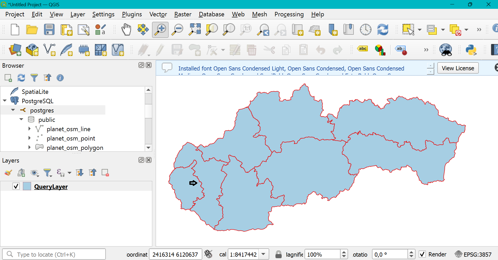

<h1> Zadanie 3</h1>

Autor: Samuel Schmidt

AIS id: 103120

<h2>Uloha 2</h2>

Zadanie: zistite aké kraje sú na Slovensku (planet_osm_polygon, admin_level = ‘4’) a vypíšte 
ich súradnice ako text s longitude a latitude.

V selecte som pretransformoval dáta z geometry na geography pomocou funkcie ST_Transform. Následne som použil funkciu ST_AsText na transformáciu geography na čitatelné súradnice long/lat. Substring len zastáva funkcionalitu pre krajší výpis. 

~~~~sql
SELECT name, substring(left(ST_ASTEXT(ST_Transform(way, 4326)::geography ),-2),10) as coordinates, way 
FROM planet_osm_polygon WHERE admin_level='4';
~~~~

<h2>Uloha 3</h2>

Zadanie: zoraďte kraje podľa ich veľkosti (st_area). Veľkosť vypočítajte pomocou vhodnej 
funkcie a zobrazte v km^2 v SRID 4326. 

Pre výpočet plochy som použil funckiu ST_Area. Pre čo najpresnejší výsledok som previedol way(geometry) na geography pomocou funkcie ST_Transform. Kraje sa nachádzajú pod admin_level 4. 

~~~~sql
SELECT name, (ST_Area(St_Transform(way, 4326)::geography))/10^6 as area, way 
FROM planet_osm_polygon WHERE admin_level='4' ORDER BY area;
~~~~

<h2>Uloha 4</h2>

Zadanie: pridajte si dom, kde bývate ako polygón (nájdite si súradnice napr. cez google maps) 
do planet_osm_polygon (znova pozor na súradnicový systém). Výsledok zobrazte na 
mape. 

Zvolil som si môj rodný dom v Budmericiach (nachádzajú sa na hranici Bratislavského kraja s Trnavským krajom). Zvolil som dva obrázky aj pre priblížený pohľad pre lepšiu vizualizáciu. Použil som pri vkladaní long/lat údaje teda geography, ktorú som previedol na geometry (typ stĺpca way). 

~~~~sql
Insert into planet_osm_polygon (name, way)
values ('house', ST_ASTEXT(ST_Transform(St_GeogFromText('SRID=4326; POLYGON((
											  17.403444019918297 48.35877744587877,
											  17.403519792324815 48.35872487002377,
											  17.403624398478946 48.35877566364728,
											  17.403541249997456 48.358829130564686, 
											  17.403444019918297 48.35877744587877))')::geometry, 3857)));
SELECT name, substring(left(ST_ASTEXT(ST_Transform(St_GeomFromText(ST_AsText(way), 3857), 4326)),-2),10) as coordinates, way 
FROM planet_osm_polygon WHERE admin_level='4' or name = 'house';
~~~~

<h2>Uloha 5</h2>

Zadanie: zistite v akom kraji je váš dom.

Najskôr som vybral môj dom a joinol k nemu všetky kraje podľa ich spoločného prieniku. Nakoniec som z tohoto joinu vytiahol meno kraja v ktorom sa môj dom nachádza. 

~~~~sql
SELECT name FROM planet_osm_polygon
join (select ST_ASTEXT(way) as way FROM planet_osm_polygon WHERE name = 'house') as house on ST_intersects(house.way, ST_ASTEXT(planet_osm_polygon.way))
where planet_osm_polygon.admin_level = '4';
~~~~

<h2>Uloha 6</h2>

Zadanie: pridajte si do planet_osm_point vašu aktuálnu polohu (pozor na súradnicovýsystém). 
Výsledok zobrazte na mape. 

Pre túto úlohu som zvolil polohu bytu v Rači. Údaje boli long/lat, čiže ich bolo potrebné opäť previesť do geometrie.

~~~~sql
Insert into planet_osm_point (name, way)
values ('my_location', ST_ASTEXT(ST_Transform(St_GeogFromText('SRID=4326; POINT(17.152118165605874 48.210158946305675)')::geometry, 3857)));
~~~~

<h2>Uloha 7</h2>

Zadanie: zistite či ste doma - či je vaša poloha v rámci vášho bývania.

Zvolil som funkciu ST_Touches pre zistenie, či moja polohu (Rača) sa nachádza u mňa doma (Budmerice). Nezvolil som funkciu WITHIN najmä preto, že táto funkcia neberie krajné body, čiže ak by som sa nachádzal na hranici môjho domu, výsledok by bol false (čo by bolo nesprávne). Výsledok bol teda false keďže Rača != Budmerice.

~~~~sql
SELECT ST_TOUCHES((select way FROM planet_osm_point WHERE name = 'my_location'), (select way FROM planet_osm_polygon WHERE name = 'house'));
~~~~

<h2>Uloha 8</h2>

Zadanie: zistite ako ďaleko sa nachádzate od FIIT (name = 'Fakulta informatiky a informačných
technológií STU'). Pozor na správny súradnicový systém – vzdialenosť musí byť
skutočná.

Pre správne riešenie úlohy som musel súradnice transformovať na geografiu, nakoľko geometria vracala nesprávny výsledok, keďže nezohľadňuje napríklad zakrivenie zeme. 

~~~~sql
SELECT ST_DISTANCE((select St_Transform(way, 4326)::geography FROM planet_osm_point WHERE name = 'my_location'), 
				   (select St_Transform(way, 4326)::geography FROM planet_osm_polygon WHERE name = 'Fakulta informatiky a informačných technológií STU'));
~~~~

<h2>Uloha 9</h2>

Zadanie: Stiahnite si QGIS a vyplotujte kraje a váš dom z úlohy 2 na mape - napr. červenou
čiarou.

Výsledok je rovnaký ako pre úlohu 2, vo vizualizácii som použil 3 obrázky pre lepšie priblíženie výsledku.

~~~~sql
select name, way from planet_osm_polygon where name = 'house' or admin_level = '4'
~~~~

<h2>Uloha 10</h2>

Zadanie: Zistite súradnice centroidu (ťažiska) plošne najmenšieho okresu (vo výsledku
nezabudnite uviesť aj EPSG kód súradnicového systému). 

Najskôr som našiel najmenší okres pomocou prieniku so Slovenskom (pretože najmenší údaj pri okresoch = admin_level 8 bol kostol v maďarsku). Z neho som následne vyselektoval plochu (prevedenú do geografie). Z nej pomocou ST_Centroid vyselektujem centroid.  

~~~~sql
WITH region as (Select name, way, (ST_Area(St_Transform(way, 4326)::geography))/10^6 as area
				 FROM planet_osm_polygon 
				 WHERE admin_level='8' AND ST_WITHIN(way, (SELECT way FROM planet_osm_polygon WHERE admin_level='2' and name='Slovensko'))
				 ORDER BY area ASC 
				 limit 1)
				 
SELECT region.name, ST_SRID(region.way), St_Transform(region.way, 4326)::geography, 
ST_ASTEXT(
	ST_transform(
		ST_centroid((Select region.way FROM region)), 4326
	)
) as centroid FROM region;
~~~~

<h2>Uloha 11</h2>

Zadanie:  Vytvorte priestorovú tabuľku všetkých úsekov ciest, ktorých vzdialenosť od
vzájomnej hranice okresov Malacky a Pezinok je menšia ako 10 km. 

V tejto úlohe som si najskôr vytvoril tabuľku, ktorá obsahuje len 3 základné info, ktoré potrebujem a to osm_id = aby každý záznam mal id, name= meno cesty, way= geometrické údaje. Najskôr som si našiel hranicu medzi Malackami a Pezinkom pomocou Intersection (ich prienik bude len ciara). Potom som si nasiel všetky cesty vo vzdialenosti 10km od tejto hranice. Použil som opäť geografiu pre presnejšie výsledky. Nebral som do úvahy flagy pre rôzne druhy ciest a to z toho dôvodu, že databáza bola pomerne rozbitá a nedalo sa z nej vyselektovať všetky rozumné cesty jednoduchým flagom. Dá sa teda tato query upresniť podľa potreby pri výbere ciest a to podmienkou WHERE za posledným joinom v sql kôde uvedenom nižšie (napr. WHERE highway is not null).

~~~~sql
CREATE TABLE IF NOT EXISTS public.roads_MA_PE
(
    osm_id bigint,
    name text COLLATE pg_catalog."default",
    way geometry(LineString,3857)
);

ALTER TABLE public.planet_osm_roads
    OWNER to postgres;

CREATE INDEX MA_PE_roads_way_idx
    ON public.roads_MA_PE USING gist
    (way)
    WITH (FILLFACTOR=100)
    TABLESPACE pg_default;

INSERT INTO roads_MA_PE(
WITH border as(
SELECT ST_TRANSFORM(ST_INTERSECTION(
	(SELECT way FROM planet_osm_polygon WHERE admin_level = '8' and name = 'okres Malacky'),
	(SELECT way FROM planet_osm_polygon WHERE admin_level = '8' and name = 'okres Pezinok')
								   ),4326)::geography as transformed
)
SELECT osm_id, name, way FROM planet_osm_roads as roads
join border on ST_DISTANCE(border.transformed,  ST_TRANSFORM(roads.way, 4326)::geography) < 10000);
~~~~

<h2>Uloha 12</h2>

Zadanie: Jedným dopytom zistite číslo a názov katastrálneho územia (z dát ZBGIS,
https://www.geoportal.sk/sk/zbgis_smd/na-stiahnutie/), v ktorom sa nachádza
najdlhší úsek cesty (z dát OSM) v okrese, v ktorom bývate. 

 
 
 

V tejto úlohe som si najskôr vyselektoval okres v ktorom sa nachádza môj dom pomocou funkcie ST_INTERSECT (dom bude mať jeden prienik s okresom). Ďalej som našiel najdlhšiu cestu v danom okrese a to pomocou funkcie CONTAINS (pretože najdlhší výsek cesty môže začínať a končiť na okrajoch okresu čo by nepokryl WITHIN). Potom som vyselektoval katastralné územia, ktoré majú prienik s danou cestou. Používal som opäť geografiu pre presnejšie výsledky. 

~~~~sql
with road as(
with region as(
SELECT name, way FROM planet_osm_polygon
join (select ST_ASTEXT(way) as house_way FROM planet_osm_polygon WHERE name = 'house') as house on ST_intersects(house.house_way, ST_ASTEXT(planet_osm_polygon.way))
where planet_osm_polygon.admin_level = '8'
)
SELECT roads.way FROM planet_osm_roads as roads
join region on ST_CONTAINS(region.way, roads.way) ORDER BY roads.way DESC limit 1
)
SELECT idn5 as id, nm5 as name, ST_TRANSFORM(ST_FORCE2D(kuku."Shape"),4326)::geography, ST_TRANSFORM(ST_FORCE2D(road.way),4326)::geography 
FROM ku_0 as kuku
join road on ST_INTERSECTS(road.way, ST_TRANSFORM(ST_FORCE2D(kuku."Shape"),3857)::geometry);
~~~~

<h2>Uloha 13</h2>

Zadanie: Vytvorte oblasť Okolie_Bratislavy, ktorá bude zahŕňať zónu do 20 km od Bratislavy,
ale nebude zahŕňať oblasť Bratislavy (Bratislava I až Bratislava V) a bude len na území
Slovenska. Zistite jej výmeru.

 

Najskôr som vyselektoval Bratislavu z planet_osm_polygon tak, že som selektol všetky okresy 1-5 a pomocou ST_UNION ich spojil do jedného polygónu (admin_level 8 a názov okres Bratislava%). Potom som pomocou ST_Buffer našiel plochu v okolí 20km od Bratislavy, kde som opäť využil geografické údaje pre lepšiu presnosť. Napríklad pre geometriu plocha nepokryla ani Senec čo je podiaľnici 14km. Pomocou SymDifference som vyselektoval len plochu mimo Bratislavy. Nasledne prienik so Slovenskom odstránil všetky časti ležiace mimo Slovenska. Plochu som získal pomocou ST_Area funkcie. Vyselektoval som si aj plochu v geografii pre znázornenie na obrázku. 

~~~~sql
with BA_area as (
with Bratislava_okolie as(
with Bratislava as(
SELECT ST_UNION(way) as way FROM planet_osm_polygon WHERE admin_level = '8' and name like ('okres Bratislava%')
)
SELECT ST_SymDifference((ST_Transform(ST_GeomFromText(ST_ASTEXT(ST_BUFFER(ST_TRANSFORM(Bratislava.way,4326)::geography, 20000)), 4326), 3857)::geometry), Bratislava.way) as way
FROM Bratislava 
)
SELECT ST_Intersection((Select Bratislava_okolie.way From Bratislava_okolie), SVK.way) as area
FROM planet_osm_polygon as SVK
WHERE name = 'Slovensko' and admin_level = '2'
)
SELECT ST_AREA(ST_TRANSFORM(BA_area.area, 4326)::geography)/10^6 as area, ST_TRANSFORM(BA_area.area, 4326)::geography FROM BA_area;
~~~~