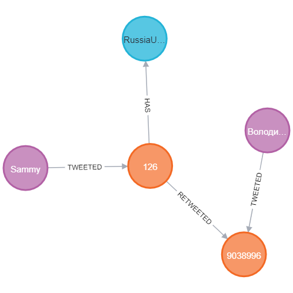

<h1> Zadanie 4</h1>

Autor: Samuel Schmidt

AIS id: 103120

<h2>Uloha 1</h2>

Zadanie: Vytvorte volaním iba jednej query nového Autora s Vašim menom (vyplňte
minimálne name a username) a tým istým volaním vytvorte tweet ktorý bude
obsahovať aspoň jeden vami vybraný Hashtag (vzťah :HAS) a ktorý bude retweetovať
najretweetovanejší tweet Vladimíra Zelenského{username:"ZelenskyyUa"}.

~~~~sql
call{
match (a:Author)-[:TWEETED]->
(t:Conversation)<-[reply:REPLIED_TO]-(:Conversation)
WHERE a.username="ZelenskyyUa"
 return a,t,count(reply) as reply_count
 order by reply_count desc
 limit 1}

 match (hashtag:Hashtag) WHERE hashtag.tag = 'RussiaUkraineCrisis'
create (t)<-[:RETWEETED]-(mytweet:Conversation{content: "My custom tweet"})-[:HAS]->(hashtag) 
create (author:Author{name:'Sammy', username: 'sammysminx'})-[:TWEETED]->(mytweet)
return author, t, mytweet, a, hashtag 
~~~~

Najskôr bolo potrebné nájsť najreetwetovanejší tweet pod od autora ZelenskyyUa. To som zistil tak, že som spočítal všetky retweety na každý príspevok od tohto autora, zoradil ich podľa počtu retweetov a vybral prvého. Ďalej som si zvolil existujúci hashtag  'RussiaUkraineCrisis' a vytvoril tweet, ktorý retweetuje najretweetovanejší tweet od autora ZelenskyyUa a priradil môjmo tweetu zvolený hashtag prostredníctvom [:HAS]. Potom som už len vytvoril autora, ktorý ukazuje vzťahom [:TWEETED] na mnou vytvorený tweet.  

<h2>Uloha 2</h2>

Zadanie: Vyhľadajte zlyhania influencerov. Vyhľadajte 20 najmenej retweetovanych tweetov
od Accountov, ktoré sú na prvých 10 miestach v celkovom počte retweetov. Aj keď
taký príklad v datasete nie je, počítajte aj s prípadom, ak by niektorý tweet bol
retweetnutý 0 krát.

~~~~sql
call{
match (author:Author)-[:TWEETED]->(:Conversation)<-[:REPLIED_TO]-(reply:Conversation) 
return author, count(reply) as most_reply_count
order by most_reply_count desc
limit 10
}

match (author)-[:TWEETED]->(tweet:Conversation)<-[:REPLIED_TO]-(rep:Conversation)
return author, tweet, count(rep) as least_reply_count
order by least_reply_count asc
limit 20
~~~~

Postupoval som tak, ža najskôr som si našiel 10 autorov, ktorý sú najretweetovanejší. Spočítal som si počty retweetov pre jednotlivých autorov, zoradil ich zostupne, a vybral prvých 10. Následne som rovnakým spôsobom dopočítal retweety už len spomedzi tweetov od týchto top 10 autorov a zoradil ich vzostupne a vybral prvých 20.

<h2>Uloha 3</h2>

Zadanie: Odporučte používateľovi (username: Marios59885699) followovanie ďalších autorov
na základe zhody v retweetovaní rovnakých tweetov: Vyhľadajte 10 autorov, ktorí
retweetli najviac tweetov rovnakych, ako používateľ Marios59885699. Počítajú sa aj
retweety tweetov, ktoré retweetujú rovnaký tweet.

~~~~sql
match(marios:Author{username: "Marios59885699"})-[:TWEETED]->(:Conversation)-[:RETWEETED]->(:Conversation)<-[:RETWEETED*1..2]-(tweet:Conversation)<-[:TWEETED]-(author:Author)
where author.username <>  marios.username
RETURN author, count(tweet) as most_retweets
order by most_retweets desc
limit 10 
~~~~

Na samom začiatku bolo potrebné nájsť konverzácie, ktoré retweetovali konverzáciu, ktorú retweetoval Marios. Prípadne konverzácie retweetujúce konverzáciu retweetujúcu konverzáciu, ktorú retweetoval Marios. Na toto som využil možnosť opakovania paternu pomocou <-[:RETWEETED*1..2]-. Ďalej bolo potrebné v podmienke WHERE uviesť, aby sa nezarátali aj retweety od Mariosa a to som docielil pomocou <> (nerovná sa). Spočítal som si teda počet týchto retweetov od rôznych autorov, zoradil ich zostupne, vybral prvých 10 a odporučil ich Mariosovi.   

<h2>Uloha 4</h2>

Zadanie: Nájdite najkratšie cesty medzi Ukrajinským parlamentom (username:
“ua_parliament”) a NextaTV (username: “nexta_tv”) cez vzťahy TWEETED,
RETWEETED, REPLIED_TO a QUOTED. Hľadajte do hĺbky maximálne 10. (hint:
allShortestPaths)

~~~~sql
match p = allShortestPaths((a1:Author{username:'ua_parliament'})-[:TWEETED|RETWEETED|QUOTED|REPLIED_TO*1..10]-(a2:Author{username: 'nexta_tv'})) return p
~~~~

Na túto úlohu som použil funkciu allShortestPaths, ktorá našla práve jednu najkratšiu cestu(mohlo ich byť však aj viacej, čo aj nepriamo vyplvýva z názvu funkcie). Hĺbku 10 som opäť zabezpečil pomocou opakovania paternu *1..10. 

<h2>Uloha 5</h2>

Zadanie: Upravte query z predchádzajúcej úlohy, aby vrátila iba nájdenú najkratšiu cestu a
jednotlivé uzly typu Conversation v nej aj spolu z autorom, ktorý ich tweetol. (hint:
UNWIND)

~~~~sql
call{
match p = allShortestPaths((a1:Author{username:'ua_parliament'})-[:TWEETED|RETWEETED|QUOTED|REPLIED_TO*1..10]-(a2:Author{username: 'nexta_tv'}))
UNWIND p AS path
UNWIND nodes(path) as elements
RETURN elements}
match (elements)<-[:TWEETED]-(a:Author) return elements, a
~~~~

Úloha v predchádzajúcej query mi vrátila všetky najkratšie cesty (aj keď bola len jedna). Bolo teda potrebné najskôr pomocou funkcie UNWIND rozbalit tieto najkratšie cesty (ktoré su po funkcii allShortestPaths v jednom riadku), do samostatných riadkov a to pomocou 'UNWIND p AS path' (pre tento prípad je táto časť redundantná nakoľko máme len jednu cestu). 

Ďalej pomocou funkcie nodes() si rozbalím tieto riadky na riadky s jednotlivými vrcholmi 'UNWIND nodes(path) as elements'. Ako posledné som našiel ku každému tomuto vrcholu autora.

<h2>Uloha 6</h2>

Zadanie: Vypíšte 10 najpoužívanejších hashtagov v datasete aj s celkovým počtom použití a
autorom, ktorý daný hashtag najviac krát použil. (hint: collect)

~~~~sql
call{
match (hashtag:Hashtag)<-[:HAS]-(tweet:Conversation)
return hashtag, count(tweet) as count_hash
order by count_hash desc
limit 10}
call{
    with hashtag
    match (hashtag)<-[:HAS]-(tweet:Conversation)<-[:TWEETED]-(author:Author)
    return hashtag as finhash, count(tweet) as count_author, author
    order by count_author desc
    limit 1
}
return hashtag.tag, count_hash, author.name, count_author
~~~~

Najskôr som si spočítal v koľkých tweetoch sa každý hashtag nachádza. Zoradil som tento výsledok zostupne a vybral prvých 10. Ďalej som pomocou 'with' posunul tieto hashtagy do ďalšej 'call' sekcie, kde som spočítal pre každého autora počet týchto najpoužívanejších hashtagov v tweetoch, ktoré on postol. Zoradil som týchto autorov zostupne pre každý hashtag podľa použitia a vybral prvého.    