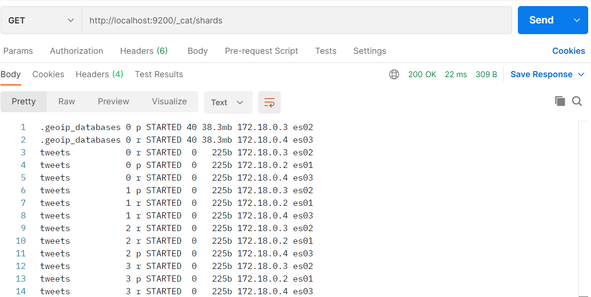
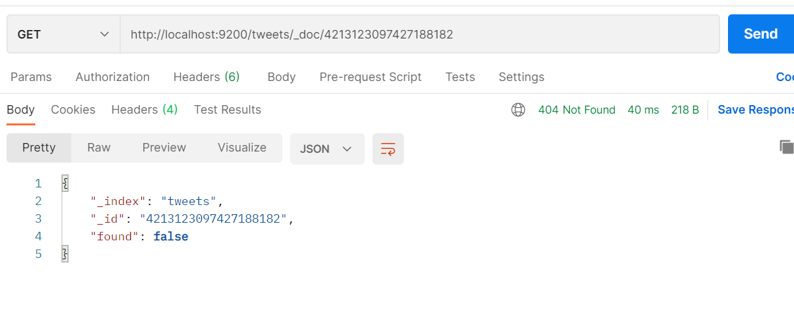

<h1> Zadanie 5</h1>

Autor: Samuel Schmidt

AIS id: 103120

<h2>Uloha 1</h2>

Zadanie: Rozbehajte si 3 inštancie Elasticsearch-u


Rozbehal som ich pomocou docker-compose scriptu, ktorý som našiel na webe a upravil. Vytvoril som .env, ktorý bol potrebný pre správne fungovanie.


Po rozbehaní som si výsledok skontroloval prostredníctvom get requestu na tieto nodes:

**GET:** `http://localhost:9200/_cat/nodes`

Výsledok:


<h2>Uloha 2</h2>

Zadanie: Vytvorte index pre Tweety, ktorý bude mať “optimálny“ počet shardov a replík pre 3
nódy (aby tam bola distribúcia dotazov vo vyhľadávaní, aj distribúcia uložených dát)


Pri tejto úlohe som sa riadil predovšetkým tým, že odporúča sa na jeden shard priradiť 5-20 GB dát. Tým, že
finálna databáza bude mať približne 80GB som zvolil 4 shardy. Je to aj z toho dôvodu, že na čím menej shardov bude DB rozdelená, tým bude rýchlejšie vyhľadávanie, keďže sa nebude musieť tak často prepínať medzi nimi (preto som volil hornú hranicu).


**PUT:** `http://localhost:9200/_cat/nodes`

Vytvorenie shardov(pre každý node 4).


**GET:** `http://localhost:9200/_cat/shards`

Skontrolovanie vytvorených shardov


<h2>Uloha 3</h2>

Zadanie: Vytvorte mapping pre normalizované dáta z Postgresu (denormalizujte ich) – Každý
Tweet teda musí obsahovať údaje rovnaké ako máte už uložené v PostgreSQL (všetky
tabuľky). Dbajte na to, aby ste vytvorili polia v správnom dátovom type (polia ktoré
má zmysel analyzovať analyzujte správne, tie ktoré nemá, aby neboli zbytočne
analyzované (keyword analyzer)) tak aby index nebol zbytočne veľký, pozor na
nested – treba ho použiť správne. Mapovanie musí byť striktné. Čo sa týka väzieb cez
referencies – pre ne zaindexujte type vsťahu, id, autor (id, name, username), content
a hashtags.


Bola potrebné vytvoriť mapping podľa tabuliek a ich vzťahov definovaných v prvom zadaní. Po dlhšej analýze jednotlivých tabuliek a hodinách skúšaniach sa mi podarilo vytvoriť štruktúru, ktorá dostatočne dobre reprezentuje danú schému.

Využil som 'strict' mapovanie, aby som predišiel deformácii mappingu a drzal sa striktne predpisu. 

Príkaz som spúšťal cez dopyt:
**PUT:** `http://localhost:9200/tweets/_mapping`

Response z requestu:


Body:
```json
{
  {
  "dynamic": "strict",
  "properties": {
    "id": {
      "type": "keyword"
    },
    "content": {
      "type": "text",
      "analyzer": "englando"
    },
    "language": {
      "type": "text"
    },
    "source": {
      "type": "text"
    },
    "retweet_count": {
      "type": "integer"
    },
    "reply_count": {
      "type": "integer"
    },
    "like_count": {
      "type": "integer"
    },
    "quote_count": {
      "type": "integer"
    },
    "created_at": {
      "type": "date"
    },
    "possibly_sensitive": {
      "type": "boolean"
    },
    "author": {
      "properties": {
        "id": {
          "type": "keyword"
        },
        "name": {
          "type": "text",
          "analyzer": "standard",
          "fields": {
            "field_ngram": {
              "type": "text",
              "analyzer": "custom_ngram"
            },
            "custom_shingles": {
              "type": "text",
              "analyzer": "custom_shingles"
            }            
          }
        },
        "username": {
          "type": "text",
          "analyzer": "standard",
          "fields": {
            "field_ngram": {
              "type": "text",
              "analyzer": "custom_ngram"
            }            
          }
        },
        "description": {
          "type": "text",
          "analyzer": "standard",
          "fields": {
            "field_englando": {
              "type": "text",
              "analyzer": "englando"
            },
            "field_shingles": {
              "type": "text",
              "analyzer": "custom_shingles"
            }            
          }
        },
        "followers_count": {
          "type": "integer"
        },
        "following_count": {
          "type": "integer"
        },
        "tweet_count": {
          "type": "integer"
        },
        "listed_count": {
          "type": "integer"
        }
      }
    },
    "annotations": {
      "type": "nested",
      "properties": {
        "value": {
          "type": "text"
        },
        "type": {
          "type": "text"
        },
        "probability": {
          "type": "float"
        }
      }
    },
    "context_annotations": {
      "type": "nested",
      "properties": {
        "domain": {
          "properties": {
            "name": {
              "type": "keyword"
            },
            "description": {
              "type": "text",
              "analyzer": "englando"
            }
          }
        },
        "entity": {
          "properties": {
            "name": {
              "type": "keyword"
            },
            "description": {
              "type": "text",
              "analyzer": "englando"
            }
          }
        }
      }
    },
    "hashtags": {
      "type": "text",
      "fields": {
        "keyword": {
          "type": "keyword",
          "normalizer": "lc_hash"
        }
      }
    },
    "references": {
      "type": "nested",
      "properties": {
        "type": {
          "type": "keyword"
        },
        "id": {
          "type": "keyword"
        },
        "author": {
          "properties": {
            "id": {
              "type": "keyword"
            },
            "name": {
              "type": "text",
              "analyzer": "standard",
              "fields": {
                "field_ngram": {
                  "type": "text",
                  "analyzer": "custom_ngram"
                },
                "field_shingles": {
                  "type": "text",
                  "analyzer": "custom_shingles"
                }            
              }
            },
            "username": {
              "type": "text",
              "analyzer": "standard",
              "fields": {
                "field_ngram": {
                  "type": "text",
                  "analyzer": "custom_ngram"
                }            
              }
            }
          }
        },
        "hashtags": {
          "type": "text",
          "fields": {
            "keyword": {
              "type": "keyword",
              "normalizer": "lc_hash"
            }
          }
        },
        "content": {
          "type": "text",
          "analyzer": "englando"
        }
      }
    },
    "links": {
      "type": "nested",
      "properties": {
        "url": {
          "type": "text"
        },
        "title": {
          "type": "text",
          "analyzer": "englando"
        },
        "description": {
          "type": "text",
          "analyzer": "englando"
        }
      }
    }
  }
}
}
```

<h2>Uloha 4</h2>

Zadanie: Pre index tweets vytvorte 3 vlastné analyzéry (v settings) nasledovne:
a. Analyzér "englando". Tento analyzér bude obsahovať nasledovné:
i. fitre: english_possessive_stemmer, lowercase, english_stop,
english_stemmer,
ii. char_filter: html_strip
iii. tokenizer: štandardný - ukážku nájdete na stránke elastic.co pre
anglický analyzér
b. Analyzér custom_ngram:
i. filtre: lowercase, asciifolding, filter_ngrams (definujte si ho sami na
rozmedzie 1- 10)
ii. char_filter: html_strip
iii. tokenizer: štandardný
c. Analyzér custom_shingles:
i. filtre: lowercase, asciifolding, filter_shingles (definujte si ho sami a
dajte token_separator: “”)
ii. char_filter: html_strip
iii. tokenizer: štandardný
d. Do mapovania pridajte:
i. každý anglický text (rátajme že každý tweet a description u autora je
primárne v angličtine) nech je analyzovaný novým analyzérom
"englando"
ii. Priraďte analýzery
1. a. author.name nech má aj mapovania pre custom_ngram, a
custom_shingles
2. b. author. screen_name nech má aj custom_ngram,
3. c. author.description nech má aj custom_shingles. Toto platí aj
pre mentions, ak tam tie záznamy máte.

iii. Hashtagy indexujte ako lowercase

Na samom začiatku ešte predtým, ako sa dal updatovať indey a pridať do neho analyzátory bolo treba ho zavrieť. To som vykonal prostredníctvom _close. Request a výsledok je znázornený nižšie.

**POST:** `http://localhost:9200/tweets/_close`


Následne bolo potrebné vytvoriť analyzátory podľa zadania a index updatnuť o tieto novo vzniknuté analyzátory. Toto cele bolo potrebné urobiť ešte predtým, než sa spustilo samotné mapovanie. 

**PUT:** `http://localhost:9200/tweets/_settings`


Body:
```json
{
    "analysis": {
        "filter": {
            "english_possessive_stemmer": {
                "type": "stemmer",
                "language": "possessive_english"
            },
            "english_stop": {
                "type": "stop",
                "stopword": "_english_"
            },
            "english_stemmer": {
                "type": "stemmer",
                "language": "english"
            },
            "filter_ngrams": {
                "type": "ngram",
                "min_gram": 2,
                "max_gram": 3
            },
            "filter_shingles": {
                "type": "shingle",
                "token_separator": ""
            }
        },
        "analyzer": {
            "englando": {
                "type": "custom",
                "filter": [
                    "english_possessive_stemmer",
                    "lowercase",
                    "english_stop",
                    "english_stemmer"
                ],
                "char_filter": ["html_strip"],
                "tokenizer": "standard"
            },
            "custom_ngram": {
                "type": "custom",
                "filter": [
                    "lowercase",
                    "asciifolding",
                    "filter_ngrams"
                ],
                "char_filter": ["html_strip"],
                "tokenizer": "standard"
            },
            "custom_shingles": {
                "type": "custom",
                "filter": [
                    "lowercase",
                    "asciifolding",
                    "filter_shingles"
                ],
                "char_filter": ["html_strip"],
                "tokenizer": "standard"
            }
        },
        "normalizer": {
            "lc_hash": {
                "type": "custom",
                "char_filter": [],
                "filter": [
                  "lowercase"
                ]
            }
        }
    }
}
```


Na samom konci bolo potrebné už len indexy opäť otvoriť aby sa nad nimi dali vykonávať read/write operácie.

**POST:** `http://localhost:9200/tweets/_open`


<h2>Uloha 5</h2>

Zadanie: Vytvorte bulk import pre vaše normalizované Tweety.

Najskôr bolo potrebné vytvoriť dopyt, pomocou ktorého sa budú dať dáta extrahovať z databázy v požadovanom formáte (definovanom v mappingu). Na základe tohoto som vyprodukoval query uvedenú nižšie. Najskôr som ju realizoval prostredníctvom INNER JOINOV a potom vytvoril jeden velký objekt, v ktorom boli dáta agregované v json objektoch. Nakoniec sa vsak ukázalo, ze v tomto prípade je velmi neefektivne pouzit inner join a omnoho lepsie je pouzit SELECT. Query pre 5000 záznamov zbehla priblizne za 1-2 s, zatial co INNER JOIN zaberal nieco okolo 2-3 minút.

Samozrejme bolo potrebné vytvoriť aj indexy pred tým, než som spustil túto query pre efektívne vyhládavanie v jednotlivých tabulkách na základe poloziek, ktoré ich spájali s Conversations (tabulka Tweetov).

~~~~sql
CREATE INDEX IF NOT EXISTS fk_index_1 ON public.conversations(author_id);
CREATE INDEX IF NOT EXISTS fk_index_2 ON public.conversation_hashtags(conversation_id);
CREATE INDEX IF NOT EXISTS fk_index_3 ON public.conversation_hashtags(hashtag_id);
CREATE INDEX IF NOT EXISTS fk_index_4 ON public.context_annotations(conversation_id);
CREATE INDEX IF NOT EXISTS fk_index_5 ON public.conversation_references(conversation_id);
CREATE INDEX IF NOT EXISTS fk_index_6 ON public.conversation_references(parent_id);
CREATE INDEX IF NOT EXISTS fk_index_7 ON public.annotations(conversation_id);
CREATE INDEX IF NOT EXISTS fk_index_8 ON public.conversations(id);
CREATE INDEX IF NOT EXISTS fk_index_9 ON public.links(conversation_id);
~~~~


Query pre vytvorenie JSON objektov
~~~~sql
	select 	conversations.id,
		(SELECT json_agg(jsonb_build_object(
			'id', authors.id, 
			'name', authors.name, 
			'username', authors.username, 
			'description', regexp_replace(authors.description, E'[\\n\\r\\f\\u000B\\u0085\\u2028\\u2029"“]+', ' ', 'g' ), 
			'followers_count', authors.followers_count,
			'following_count', authors.following_count,
			'tweet_count', authors.tweet_count,
			'listed_count', authors.listed_count
		)) FROM authors WHERE id = conversations.author_id) as author,
		regexp_replace(conversations.content, E'[\\n\\r\\f\\u000B\\u0085\\u2028\\u2029"“]+', ' ', 'g' ) as content,
		conversations.possibly_sensitive,
		conversations.language,
		conversations.source,
		conversations.retweet_count,
		conversations.reply_count,
		conversations.like_count,
		conversations.quote_count,
		conversations.created_at,
		(SELECT json_agg(distinct hashtags.tag) FROM hashtags WHERE hashtags.id in (SELECT hashtag_id FROM conversation_hashtags WHERE conversation_id = conversations.id)) as hashtags, 
		(SELECT json_agg(distinct jsonb_build_object(
			'url', links.url, 
			'title', links.title, 
			'description', links.description
		)) FROM links WHERE conversation_id = conversations.id) as links,
		(SELECT json_agg(distinct jsonb_build_object(
			'value', annotations.value, 
			'type', annotations.type, 
			'probability', annotations.probability
		))FROM annotations WHERE conversation_id = conversations.id) as annotations,
		(SELECT json_agg(distinct jsonb_build_object(
			'domain', (SELECT jsonb_build_object(
				'name', context_domains.name, 
				'description', context_domains.description) FROM context_domains WHERE id = context_annotations.context_domain_id),
			'entity', (SELECT jsonb_build_object(
				'name', context_entities.name, 
				'description', context_entities.description) FROM context_entities WHERE id = context_annotations.context_entity_id)
		)) FROM context_annotations WHERE conversation_id = conversations.id) as context_annotations,
		
		(SELECT json_agg(distinct jsonb_build_object(
			'type', conversation_references.type, 
			'id', (SELECT conversations.id FROM conversations WHERE id = conversation_references.parent_id),
			'content', regexp_replace((SELECT conversations.content FROM conversations WHERE id = conversation_references.parent_id), E'[\\n\\r\\f\\u000B\\u0085\\u2028\\u2029"“]+', ' ', 'g' ),
			'author', (SELECT jsonb_build_object(
				'id', authors.id,
				'name', authors.name,
				'username', authors.username) FROM authors WHERE id = (SELECT conversations.author_id FROM conversations WHERE id = conversation_references.parent_id)),
			'hashtags', (SELECT json_agg(distinct hashtags.tag) FROM hashtags WHERE hashtags.id in (SELECT hashtag_id FROM conversation_hashtags WHERE conversation_id = (SELECT conversations.id FROM conversations WHERE id = conversation_references.parent_id)))
		)) FROM conversation_references WHERE conversation_id = conversations.id) as references

from conversations
group by conversations.id
limit 5000;
~~~~

Ďalej už len bolo potrebné extrahovať tieto dáta do json súboru:
~~~~sql
COPY (SELECT json_agg(row_to_json(result))
FROM (...
'Query'
...) AS result
) TO 'path\dump_1.jsonl' WITH(HEADER FALSE);
~~~~


<h2>Uloha 6</h2>

Zadanie: Importujete dáta do Elasticsearchu prvych 5000 tweetov

Pre túto úlohu som v pythone vytvoril krátky script, ktorý slúži na transformovanie jsonl súboru z úlohy 5 do požadovaného elastic formátu (pridal som každému riadku `{ "index": { "_index": "tweets" } }\n`). Následne som tieto dáta importoval úspešne do Elasticu.

```python
import requests
import json


js_file = open('dump.jsonl', encoding='utf8')

payload = ""

for line in js_file:
    payload += '{ "index": { "_index": "tweets" } }\n' + line

res = requests.post('http://localhost:9200/tweets/_bulk', 
headers={'Content-Type': 'application/x-ndjson'},
data=payload.encode('utf8'))

print(res.text)
```

Zobrazenie výpisu do konzoly po úspešnom načítaní:


Na skontrolovanie, či sa do Elasticu importovali všetky dáta, som použil následovný request:
**GET:** `http://localhost:9200/tweets/_count`


<h2>Uloha 7</h2>

Zadanie: Experimentujte s nódami, a zistite koľko nódov musí bežať (a ktoré) aby vám
Elasticsearch vedel pridávať dokumenty, mazať dokumenty, prezerať dokumenty a
vyhľadávať nad nimi? Dá sa nastaviť Elastic tak, aby mu stačil jeden nód? Čo je
dôvodom toho že existuje nejaké kvórum?


Pre toto zadanie som si vytvoril dokument, podľa mappingu:

Body:
```json
{
  "id": 4213123097427188182,
  "content": "Bonjorno",
  "possibly_sensitive": false,
  "language": "en",
  "source": "Budmerike",
  "retweet_count": 10,
  "reply_count": 100,
  "like_count": 10000,
  "quote_count": 111,
  "created_at": "2022-07-04T23:12:08.000Z",
  "author": {
    "name": "Sami",
    "username": "Sminx",
    "description": "Bc ako Bijec",
    "followers_count": 100,
    "following_count": 10000,
    "tweet_count": 100,
    "listed_count": 100 
  },
  "hashtags": ["jbmnt", "VelosPodPeros"],
  "references": null,
  "links": {
    "url": null,
    "title": null,
    "description": null
  },
  "annotations": {
    "value": null,
    "type": null,
    "probability": null
  },
  "context_annotations":null
}
```

Pridávanie dokumnetov som robil cez request:
**PUT:** `http://localhost:9200/tweets/_doc/4213123097427188182`

Mazanie dokumnetov som robil cez request:
**DELETE:** `http://localhost:9200/tweets/_doc/4213123097427188182`

Vyhľadávanie nad dokumentmi som robil cez request:
**POST:** `http://localhost:9200/tweets/_search`
Body:
```json
{
   "size": 10,
   "query": {
      "match_all": {}
   }    
}
```

Prezeranie dokumnetov som robil cez request:
**GET:** `http://localhost:9200/tweets/_doc/4213123097427188182`


Postupne som skúšal jednotlivé kombincie zapínania a vypínania nodov a pre každú kombináciu som vyskúšal všetky 4 requesty. Moje výsledky radšej len popíšem, pretože by to zabralo veľa priestoru a pridalo na neprehľadnosti. 

Zistil som že: 
HTTP requesty sa nedajú robiť, ak nie je zapnutý node poslúchajúci na porte :9200(v tomto prípade). Ak nie je zapnutý, žiadny z uvedených requestov nezbehne. 

Vyhľadávanie a prezeranie dokumentov ide aj s jedným nodom, pokiaľ tým jedným nodom je node poslúchajúci na porte :9200. Ak tento node vypneme, žiadna iná kombinácia nefunguje.

Pridávanie a mazanie dokumentov je možné len vtedy, ak je zapnutý master node a rovnako aj node poslúchajúci na porte :9200. Najskôr som mal poslúchajúci node es01 a master node es03. Pir vypínaní a zapínaní sa však stalo to, že keď som nechal zaplnutý len es01 a es02, zmenil mastera z es03 na es01 a tý pádom zbehli všetky requesty. Ak som však ešte pred tým, než sa stal es01 master ale bol len listener, pustil tieto requesty, prebehli len requesty na vyh+adávanie a prezeranie.

Dôvod tohto kvôra je teda to, že môžeme redukovať nody a funkcionalita sa nezmení, dokedy bude aktívny node odpočúvajúci na nami zvolenom porte + bude aktívny aj master node.

Pridávam len pre ukážku 2 prípady:
1.) listener na porte :9200 bol vypnutý


2.) listner je zapnutý, ale master je vypnutý

Nedá sa pridať dokument:


Dá sa však prezerať dokument:



Master node som si našiel pomocou requestu:
**GET:** `http://localhost:9200/_cat/master`


<h2>Uloha 8</h2>

Zadanie: Upravujte počet retweetov pre vami vybraný tweet pomocou vašeho jednoduchého
scriptu (v rámci Elasticsearchu) a sledujte ako sa mení _seq_no a _primary_term pri
tom ako zabíjate a spúšťate nódy.

Pre túto úlohu som si napísal krátky script na inkrementovanie retweet count-u pre `id` = `983678505710911488`.
Toto id malo index v elasticu = `Z1hTPYUBBMw-Q38wUUrx`.

Volal som tea tento script prostredn9ctvom requestu:
**POST:** `http://localhost:9200/tweets/_update/Z1hTPYUBBMw-Q38wUUrx`

Body:
~~~~json
{
    "script": "ctx._source.retweet_count += 1"
}
~~~~

Keď boli zapnuté všetky nodes, inkrementovalo sa každým updatom len `seq_no`. Podľa dokumentácie by toto číslo malo predstavovať číslo zmeny nad týmto dokumentom, a je dobré ho mať najmä preto, ak by nastali nejaké konflikty pri zmenách nad týmto dokumentom. Ide o to aby nejaka stará verzia tohto dokumentu ne prepísala novú updatnutú verziu (nová má vyššie `seq_no`).


Je vidieť že sa zmenilo len `seq_no`. V prípade že však vypneme master node a tým pádom aj hlavný shard, inkrementuje sa okrem `seq_no` aj `primary_key`.


Čo sa týka `primary_term`, ten sa menil najmä vtedy ak bol vypnutý hlavný shard a bola vykonaná zmena. Vtedy tieto requesty idú na repliku a vtedy sa zvýši primary_term. Keď sa hlavný shard opäť zapne, tak vidí že na replike je iný primary_term je vyšší ako predtým a teda sa updatne.  


<h2>Uloha 9</h2>

Zadanie: Zrušte repliky a importujete všetky tweety


Ulohu 9 sa mi nepodarilo vypracovať, nakoľko nemám dostupné prostredieky na realizovanie takej velkej migrácie dát.


<h2>Uloha 10</h2>

Zadanie: Vyhľadajte vo vašich tweetoch, kde použite function_score pre jednotlivé
medzikroky nasledovne:
a. Must:
    i. Vyhľadajte vo viacerých poliach naraz (konkrétne:
    author.description.shingles (pomocou shingle) – boost 10, content
    (cez analyzovaný anglický text) spojenie – boost 6 "put1n chr1stian
    fake jew", zapojte podporu pre preklepy, operátor je OR.
    ii. V poly referencies.content slovo “nazi”
    iii. Hashtag “ukraine”
b. Filter:
    i. vyfiltrujte len tie, ktoré majú author.following_count > 100, tie ktoré
    majú author.followers_count > 100 a tie, ktoré majú nejakú linku

c. Should:
    i. Ak sa v context_annotations.domain.name nachádza “Person”
    boostinte o 5
    ii. Ak sa v context_annotations.entity.name nachádza “Soros” boostnite
    o 10
    iii. Ak je vyhľadaný string “put1n chr1stian fake jew” aj fráza s tým ze sa
    môže stat jedna výmena slov boostnite o 5

d. Agregácie:
    i. Vytvorte bucket pro-russia ktorý obsahuje hastagy používane
    Kremľom na propagandu: istandwithputin, racism, 1trillion,
    istandwithrussia, isupportrussia, blacklivesmatter, racism,
    racistukraine, africansinukraine, palestine, israel, freepalestine,
    istandwithpalestine, racisteu, putin
        1. Pre neho spravte týždňový histogram, kde pre každý týždeň
        zobrazte štatistiky


Tento request som volal následovne:
**GET:** `http://localhost:9200/tweets/_search`

Body:
```json
{
  "query": {
    "function_score": {
      "query": { 
        "bool": {
            "must" : [
                  {
                      "multi_match" : {
                          "query" : "put1n chr1stian fake jew",
                          "fields": ["content^6", "author.description.custom_shingles^10"],
                          "operator": "or",
                          "fuzziness": "AUTO"
                      }
                  }
                //   {
                //       "match" : {
                //           "referencies.content": "nazi"
                //       }
                //   },
                //   {
                //       "match" : {
                //           "hashtags": "ukraine"
                //       }
                //   }

                ],
                "filter": [ 
                { "range": { "author.following_count": { "gte": 100 } } },
                { "range": { "author.followers_count": { "gte": 100 } } },
                {"bool": {"must_not":{ "match" : {"links": {"query": "null"}}}}}
                ],
                "should" : [
                    {"match": {
                        "context_annotations.domain.name" : {
                        "query" : "Person",
                        "boost" : 5
                            }
                        }
                    },
                    {"match": {
                        "context_annotations.entity.name" : {
                        "query" : "Soros",
                        "boost" : 10
                            }
                        }
                    },
                    {
                      "multi_match" : {
                          "query" : "put1n chr1stian fake jew",
                          "fields": ["content^5"],
                          "operator": "or"
                      }
                    }

                ]
   
            }
        }
    }
  },
  "aggs": {
        "pro-russia": {
            "date_histogram": {
                "field": "created_at",
                "calendar_interval": "week"
            },
            "aggs": {
               "tags" : {
                   "filter" : {
                       "match" : {
                           "hashtags" : {
                           "query" : "istandwithputin racism 1trillion istandwithrussia isupportrussia blacklivesmatter racism racistukraine africansinukraine palestine israel freepalestine istandwithpalestine racisteu putin"
                           }
                       }
                   },
                   "aggs":{
                    "statistics":{
                        "terms": {
                            "field": "hashtags.keyword"
                        }
                    }
                   }
               }
            }
        }
  }
}
```

Response:


Na začiatku som začal s podmienkou Must. Tu som zapojil custom_shingles z tvorby analyzátorov a multi_match. Fuzziness = "Auto" zabezpečuje rozumnú toleranciu preklepov. Nakoľko sa mi nepodarilo importovať celú databázu kvoli pamäťovej náročnosti, pracoval som iba s 5000 záznamami, čo znamená že zvyšné 2 podmienky pre MUST sú zakomentované z toho dôvodu, aby request nieco vracal. Obe podmienky sú však funkčné (stačí len odkomentovať).

Ďalej som vytváral Filtre. Tu nebol problém urobiť filtre pre following_count a followers_count. Problém, ktorý sa mi žiaľ nepodarilo vyriešiť bolo pre links. Podmienka must_not totiž vracia aj také výsledky, kde links=null. Podmienka exists nefungovalo a nedopátral som sa k nicomu lepsiemu. 

Should pre Sorosa a Person je len jednoduchý match, každý len boostnutý o inú hodnotu. Multi_match však aj so zámenou slov sa mi nepodarilo implementovať. 

Na samom konci to boli agregácie, kde som posutpoval tak ža, na samom začiatko sa vytvorí histogram po jednotlivých týždňoch. Na kazdom zázname teda prvý doc_count predstavuje počet dokumentov v danom týždni.  V parametri `tags` je uvedený druhý doc_count, ktorý hovorí o tom, koľko požadovaných hashtagov sa nachádza v dokumentoch z daného týždňa. V parametri `statistics` je aj presne vidieť, ktoré požadované hashtagy sa v danom týždni vyskytovali a aj koľkokrát.
